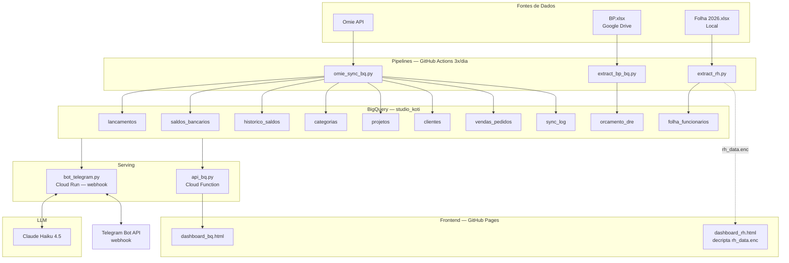

# Arquitetura — Dashboard Koti

## Diagrama

## Stack

| Camada | Tecnologia |
|--------|-----------|
| Linguagem | Python 3.11 (pipelines), 3.12 (bot Docker) |
| Data Warehouse | BigQuery |
| CI/CD | GitHub Actions (sync 3x/dia + deploy bot on push) |
| Bot | Cloud Run — webhook mode, auto-discover URL |
| API | Cloud Functions (us-central1) |
| Frontend | HTML/JS — GitHub Pages |
| LLM | Claude Haiku 4.5 (Anthropic SDK) |
| Mensageria | Telegram Bot API (webhook via Cloud Run) |
| Criptografia | AES-256-GCM + PBKDF2 (rh_data), PBKDF2 (login) |
| Secrets | GCP Secret Manager (bot tokens), GitHub Secrets (SA key) |

## Fluxo de dados

1. **Ingestão**: GitHub Actions roda 3x/dia (5h, 12h, 18h BRT)
   - `omie_sync_bq.py` — puxa lançamentos, saldos, clientes, projetos, vendas do Omie
   - `extract_bp_bq.py` — extrai DRE Real vs Orçado da planilha BP.xlsx (valida labels antes)
   - `extract_rh.py` — extrai folha agregada → `rh_data.json` + `rh_data.enc` + upload BQ individual

2. **Dashboard**: `api_bq.py` (Cloud Function) serve JSON agregado → `dashboard_bq.html` renderiza gráficos com Chart.js
   - `dashboard_rh.html` carrega `rh_data.enc` e decripta no browser com crypto.subtle
   - Login com PBKDF2 (10k iterações, salt fixo)
   - Badges de regime contábil (caixa/competência) por aba

3. **Bot Telegram**:
   - Usuário pergunta no Telegram → webhook no Cloud Run
   - `bot_telegram.py` envia para Claude Haiku → gera SQL BigQuery
   - Pós-processamento: injeta `nome` em queries de folha, remove GROUP BY indevido
   - Executa no BigQuery → Haiku formata resposta → envia no Telegram
   - RBAC: chat IDs autorizados, exec IDs para folha/saldos

## Segurança

- **Dados RH**: encriptados em repouso (`rh_data.enc`), `rh_data.json` no `.gitignore`
- **Login dashboard**: PBKDF2 sem fallback plaintext
- **Bot**: rate-limit, SQL read-only, tabelas restritas por nível de acesso
- **Secrets**: GCP Secret Manager para tokens, GitHub Secrets para SA key
- **Rotação**: trimestral (SA key, bot token, API key) — ver CLAUDE.md
