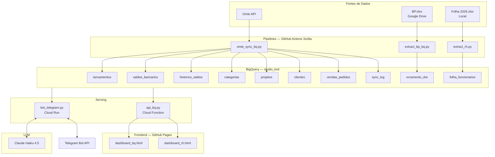

# Arquitetura — Dashboard Koti

## Diagrama

## Stack

| Camada | Tecnologia |
|--------|-----------|
| Linguagem | Python 3.11 |
| Data Warehouse | BigQuery |
| CI/CD | GitHub Actions |
| Bot | Cloud Run (webhook) |
| API | Cloud Functions |
| Frontend | HTML/JS — GitHub Pages |
| LLM | Claude Haiku 4.5 (Anthropic) |
| Mensageria | Telegram Bot API |

## Fluxo de dados

1. **Ingestão**: GitHub Actions roda 3x/dia (5h, 12h, 18h BRT) — puxa dados do Omie, BP e Folha para BigQuery
2. **Dashboard**: `api_bq.py` (Cloud Function) serve JSON agregado → `dashboard_bq.html` renderiza gráficos
3. **Bot**: usuário pergunta no Telegram → `bot_telegram.py` (Cloud Run) envia para Claude Haiku → Haiku gera SQL → executa no BigQuery → Haiku formata resposta → envia no Telegram
